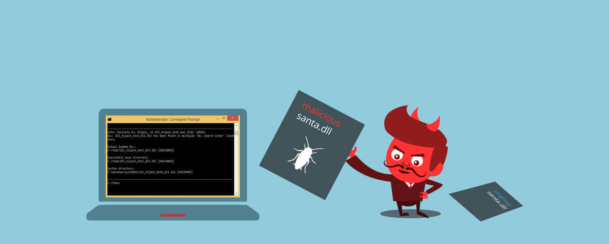
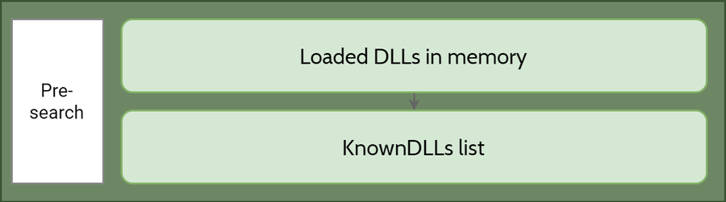
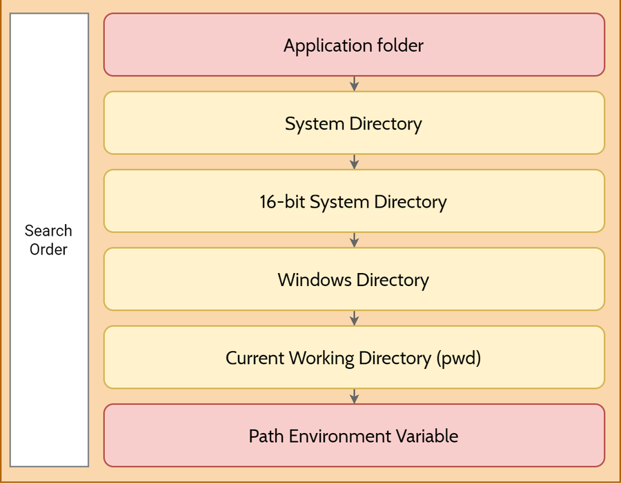
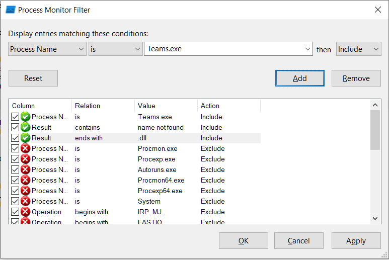

# DLL Hijacking

Die Betriebsysteme von Microsoft Windows gehören zu den meistgenutzten Betriebssystemen auf dem Markt.
Ungefähr 1,5 Milliarden Nutzer arbeiten täglich mit den Windows-Betriebssystemen im privaten oder geschäftlichen Umfeld [13].
Eine aktuelle Statistik von Statista zeigt, dass allein Windows 10 im Januar 2022 einen weltweiten Marktanteil von rund 70,3% erreicht [14].

Neben der hohen Anwenderzahl besitzt Windows gleichzeitig viele Sicherheitsbedrohungen und Schwachstellen, die Angreifer ausnutzen können, um die Systeme zu kompromittieren.
Dazu gehört auch der Angriff über DLL-Dateien. Diese Bibliotheksdateien werden verwendet, um dem Betriebssystem oder Anwendungsprogrammen weitere Funktionalitäten zu verleihen, die diese bei Ausführung benötigen.
In diesen Dateien kann darüber hinaus Schadsoftware versteckt sein, die nach dem Laden einer DLL-Datei zur Ausführung kommen kann. Mithilfe einer DLL-Datei können wiederum mehrere Programme ausgeführt werden, sodass mehrere Programme möglicherweise in einem DLL-Hijacking-Angriff involviert sein können.

In diesem Wiki-Artikel geht es darum, welchen Nutzen DLL haben, wie Windows das Laden von DLLs handhabt, wie Hacker die Suchkette von DLLs ausnutzen können, um einen Angriff durchzuführen und was Entwickler tun müssen, um Schwachstellen zu vermeiden.

Das Thema DLL-Hijacking spricht mich an, da es sehr vielseitig ist und zahlreiche Angriffsmöglichkeiten bietet, basierend darauf, wie tief der Angreifer das Zielsystem versteht und welche Fähigkeiten dieser besitzt.
Für mich als Windows Nutzer ist es besonders interessant, da ich Lösungsmöglichkeiten kennenlernen möchte, um
mich vor DLL-Hijacking zu schützen und diese Angriffsform zu verhindern.

## Was sind DLLs?

Die Abkürzung DLL steht für **Dynamic Linked Library** und bezeichnen dynamische Programmbibliotheken.  
Für die Windows Betriebssysteme wird ein Großteil der Funktionalität des Betriebssystems von der DLL bereitgestellt.
Im Allgemeinen enthalten Programme viele verschiedene Module, die wiederum in DLLs enthalten sind und verteilt werden.
Die Verwendung von DLLs trägt dazu bei, die Modularisierung von Code, die Wiederverwendung von Code, die effiziente Speicherauslastung und den reduzierten Speicherplatz zu fördern.
Dies ermöglicht das Betriebssystem und dessen Anwendungsprogramme schneller zu laden und auszuführen sowie Speicherplatz auf dem Computer einzusparen. [10]

## Was versteht man unter Hijacking?

Hijacking (z. Dt. „Entführung“ oder „gewaltsame Übernahme“) beschreibt im Allgemeinen verschiedene Arten von Computerangriffen, die darauf abzielen, widerrechtlich die Kontrolle über ein System zu erlangen. Das können
zum Beispiel Internetadressen, Browser, Benutzerkonten, Computer oder ganze Server sein [15, 16].
Das DLL-Hijacking beschreibt im Speziellen das Kompromittieren eines Systems auf der Grundlage von DLL-Dateien.

## Impliziertes und expliziertes Linken von DLL-Dateien

Es gibt zwei Möglichkeiten, wie eine Anwendung Funktionen aus DLL-Dateien importiert:

- implizit: Load-time Dynamic Linking
- explizit Run-Time Dynamic Linking

### Load-Time Dynamic Linking

Wenn eine Anwendung geöffnet wird, führt der Windows-Loader verschiedene Schritte aus, um das ausführbare Programm der Anwendung im Arbeitsspeicher abzubilden und schließlich einen Prozess zu starten, der den Code hostet und ausführt.
Während des Ladevorgangs analysiert der Windows-Loader die Importtabelle des ausführbaren Images, um die importierten Module - die DLL-Dateine - im Adressraum dieses Prozesses abzubilden.
In diesem Fall spricht man von **Load-Time Dynamic Linking**, da die DLL Dateien vor Ausführung der Anwendung geladen werden.
Ein ausführbares Image einer Anwendung enthält häufig ein Manifest, das Abhängigkeiten von Windows Side-by-Side-Assemblies beschreibt. Vor dem Laden der importierten DLL-Datei prüft der Side-by-Side Manager (SxS Manager), ob in der Manifestdatei eine ausführbare Datei vorhandenen ist, die Abhängigkeiten besitzt und DLL referenziert.
Wenn ja, werden die benötigten Module aus dem Side-by-Side Verzeichnis geladen.
Das ist üblicherweise unter dem Pfad C:\Windows\WinSxS\ aufzufinden [1].

Bei den restlichen importierten Modulen prüft der Loader zunächst, ob jede der zu importierenden DLLs in der Liste der System bekannten DLLs vorhanden ist.
Die Liste der bekannten DLLs ist unter folgenden Registrierungsschlüssel aufzufinden: HKEY_LOCAL_MACHINE\SYSTEM\CurrentControlSet\Control\Session Manager\KnownDLLs [11].
Ist dass der Fall, verwendet der Loader eine Kopie der DLL, auf die der Registrierungsschlüssel verweist. Andernfalls sucht dieser nach dem Modul, nach einer bestimmten DLL-Suchreihenfolge.
Mehr zur DLL-Suchreihenfolge folgt im weiteren Artikel.

### Run-Time Dynamic Linking

Werden Funktionen innerhalb von DLLs verwendet, die während der Ausführung von Anwendungen dynamisch geladen werden, liegt **Run-Time Dynamic Linking** vor. Dabei rufen die Applikation die Funktionen LoadLibrary oder LoadLibraryEx auf. Diese beiden Funktionen verlangen die Angabe des Namens der zu ladenden DLL. Der Name kann entweder der Dateiname des Moduls oder ein vollständiger Pfad zum Modul sein. Wenn die Anwendung keinen vollständigen Pfad zum Modul angibt, sucht der Windows-Loader nach der DLL, die der DLL-Suchreihenfolge folgt.
[1, 4]

## DLL Suchreihenfolge

Da ein System über mehrere Versionen derselben DLL verfügen kann, obliegt es den Anwendungen den Speicherort zu spezifizieren, von dem eine DLL geladen wird. Dies kann durch Angabe eines vollständigen Pfades oder in einer Manifest-Datei erfolgen.
Ist keine Angabe gemacht worden, sucht das System zur Ladezeit (Load-Time) nach der DLL. [11]

Bevor das System nach der DLL sucht, werden folgende Faktoren berücksichtigt:

- Wenn eine DLL bereits mit dem gleichen Modulnamen in den Arbeitsspeicher geladen wurde, dann verwendet das System diese, unabhängig davon, in welchem Verzeichnis sie sich befindet.

- Wenn sich die DLL in der Liste der bekannten DLLs befindet (unter: HKLM\System\CurrentControlSet\Control\Session Manager\KnownDLL), verwendet das System dessen Kopie anstatt nach der DLL zu suchen.

Windows den sogenannten "Sicheren DLL-Suchmodus", um nach der angeforderten DLL zu suchen. Dieser Modus wird durch den Registrierungswert HKEY_LOCAL_MACHINE\System\CurrentControlSet\Control\Session Manager\SafeDllSearchMode gesteuert. Standardmäßig ist der SafeDLLSearchMode aktiviert, sodass dieser Bereich
meist kein Ziel von Angreifern darstellt.

Allerdings stellt die Suchreihenfolge von DLL-Dateien mehrere Angriffsmöglichkeiten dar, die von Angreifern
ausgenutzt werden können. Kommt es dazu, dass das System nach der DLL sucht, wird folgende Reihenfolge berücksichtigt:

Zuerst wird nach der DLL in dem Ordner gesucht, aus dem die Applikation geladen wird.
Wenn die DLL dort nicht existiert, wird als nächstes das Systemverzeichnis (C:\Windows\System32\) durchsucht. Im Anschluss
das 16-bit Systemverzeichnis (C:\Windows\System\), das Windows Verzeichnis (C:\Windows\System32\), das aktuelle Verzeichnis und zuletzt Verzeichnisse die unter der PATH Umgebungsvariable gelistet ist. [4]

Vor allem die Orte in der Suchreihenfolge, die rot markiert sind, können von Angreifer leicht manipuliert werden, besonders wenn diese über beliebige Schreibrechte verfügen. Kann ein Angreifer Dateien in den Anwendungsordner oder in einen der Umgebungspfadordner, der nur schwachen Berechtigungen besitzt, ablegt, so kann er die vorgesehene DLL durch eine bösartige ersetzt werden und das System kompromittieren. [4, 6]

## Wie kann DLL Search-Order Hijacking identifiziert werden

Die System Terminal Tools für Windows ermöglichen es Tiefe Einblicke in das System und die dahinterliegenden Prozesse zu erhalten. Darunter fällt auch das Process-Monitoring-Tool von Microsoft [8].
Dieses ermöglicht es die Verwendung von DLLs durch Anwendungsprogramme zu identifizieren.

Filtering:

- DLL die beim Starten geladen wird: VERSION.dll
- profapi.dll

## Angriffsmöglichkeiten durch DLL-Hijacking

Neben dem Angriff über die DLL-Surchorderreihenfolge gibt es auch noch die Möglichkeit über einen DLL-Sideloading Angriff.
DLL-Sideloading ist eine zunehmend beliebte Cyber-Angriffsmethode, bei der schadhafte DLL-Dateien im Windows WinSxS-Verzeichnis durch Maleware platziert wird. Das Betriebssystem lädt anstelle der legitimen DLL-Datei die gefälschte injizierte DLL-Datei [15].

- DLL and Applikation are in same folder
- UAC Bypass: Create anotehr windows directory
- Search Order: put in first path that is writeable

## Maßnahmen zur Vermeidung von DLL-Hijacking

1. DLL-Laden von Remote-Netzwerkfreigaben deaktivieren
2. Laden von DLL-Dateien von WebDAV deaktivieren
3. WebClient-Dienst vollständig deaktivieren oder auf manuell setzen
4. Blockieren Sie die TCP-Ports 445 und 139, wie sie am häufigsten für Computer kompromittiert werden
5. Installieren Sie die neuesten Updates für den Betrieb System- und Sicherheitssoftware

## Quellen

 [1] https://www.contextis.com/en/blog/dll-search-order-hijacking
 [2] https://book.hacktricks.xyz/windows/windows-local-privilege-escalation/dll-hijacking (most interesting)
 [3] https://www.upguard.com/blog/dll-hijacking
 [4] https://itm4n.github.io/windows-dll-hijacking-clarified/
 [5] https://attack.mitre.org/techniques/T1574/001/
 [6] https://stillu.cc/threat-spotlight/2020/09/16/dll-hijacking/
 [7] https://book.hacktricks.xyz/windows/windows-local-privilege-escalation/dll-hijacking
 [8] https://docs.microsoft.com/de-de/sysinternals/downloads/procmon
 [9] https://medium.com/techzap/dll-hijacking-part-1-basics-b6dfb8260cf1
 [10] https://docs.microsoft.com/de-de/troubleshoot/windows-client/deployment/dynamic-link-library
 [11] https://docs.microsoft.com/de-de/windows/win32/dlls/dynamic-link-library-search-order
 [12] https://en.wikipedia.org/wiki/PATH_(variable)
 [13] https://www.it-daily.net/it-sicherheit/cybercrime/27834-rekordzahl-an-kritischen-microsoft-sicherheitsluecken
  [14] https://de.statista.com/statistik/daten/studie/828610/umfrage/marktanteile-der-fuehrenden-betriebssystemversionen-weltweit/
  [15] https://www.mandiant.com/resources/dll-side-loading-another-blind-spot-for-anti-virus
  [16] https://de.ryte.com/wiki/Hijacking
  [17] https://www.indusface.com/blog/dll-hijacking/

Struktur:

1. Skizzieren Sie ein Beispiel anhand dessen Sie die folgenden Fragen beantworten und erklären Sie kurz warum Sie speziell dieses gewählt haben: DLL-Hijacking
2. Zeigen Sie die Sicherheitsaspekte Ihres gewählten Beispiels auf und diskutieren Sie diese:
3. Wählen Sie ein Szenario zu Fehlfunktion, Hack, Ausfall und beschreiben Sie die Auswirkungen für die Betroffenen:
4. Beschreiben Sie nun Mechanismen um dem entgegen zu wirken, dies zu verhindern, zu erkennen, einzudämmen, darauf zu reagieren:
